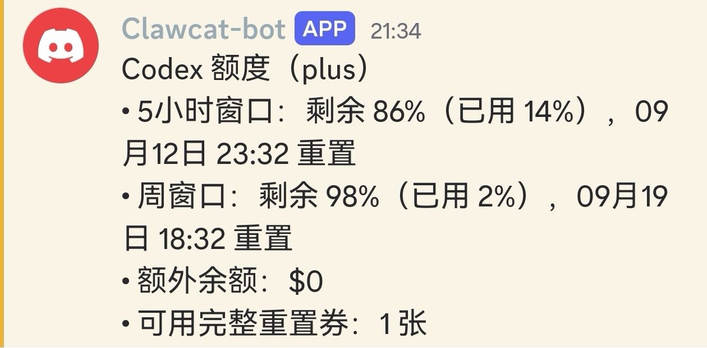

# codexq-discord

一个 Hermes 插件：把 **Hermes 已配置的 OpenAI Codex OAuth** 额度查询包装为 Discord 原生斜杠指令 `/codexq`。

## 特性

- 注册无参数的 `/codexq` 指令。
- 使用 Hermes 自己的 `openai-codex` OAuth 凭据查询额度。
- 通过 ChatGPT Codex 用量端点查询当前账号的 5 小时窗口、周窗口、额外余额和重置券；本机 Codex CLI 同账号时额外显示每张可用重置券的到期时间。
- 输出前只保留额度字段；绝不输出 OAuth token、账号 ID、用户 ID 或邮箱。
- 不接受用户参数，不通过 shell 执行命令。

## 前置条件

1. Hermes 的默认模型或凭据池已配置 `openai-codex` OAuth（用 `hermes auth list openai-codex` 验证）。
2. Hermes 已配置并连接 Discord。

## 示例

下图为 Discord `/codexq` 的额度输出示例。



## 安装

将此目录放到当前 Hermes profile 的插件目录中，例如：

```bash
cp -R codexq-discord ~/.hermes/plugins/codexq-discord
hermes gateway restart
```

在 Discord 中输入：

```text
/codexq
```

> 原生斜杠命令只支持无参数调用。不要在 `/codexq` 后附加自然语言；那会被命令处理器视为无效参数。

## 安全说明

- 插件经 Hermes 的 `resolve_codex_runtime_credentials()` 取得短时运行凭据。
- 凭据仅作为请求头发往 OpenAI 的 Codex 用量端点，不会打印、写盘或进入 Discord 消息。
- 上游响应中的 `user_id`、`account_id`、`email` 等字段会被丢弃。
- 代码不包含任何令牌、账号、Webhook、服务器地址或个人本机路径。
- `.gitignore` 排除 `.env`、虚拟环境、缓存和编辑器配置。

## 开发验证

```bash
python3 -m py_compile __init__.py codexq.py
python3 -m unittest discover -s tests -v
# 在运行 Hermes gateway 的 Discord 中调用 /codexq 验证集成
```

## 许可

MIT
